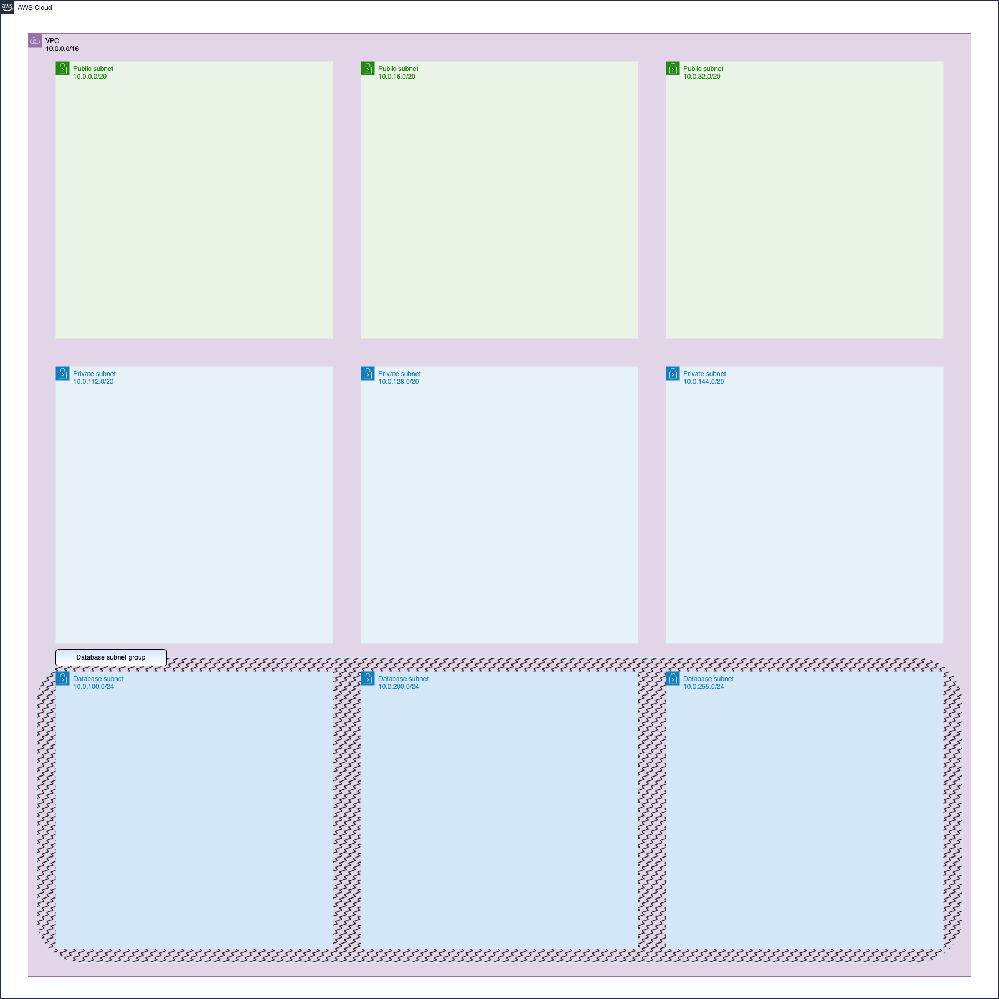

## Description

This module creates basic networking infrastructure.

Resources overview:

- <strong>VPC</strong> (with more than 65K IP addresses available there);
- <strong>Subnets</strong> divided to <strong>Public</strong>, <strong>Private</strong>, <strong>Database</strong> (more than 4K IP addresses are available for Public and Private subnets, more than 200 IP addresses; are available for Database subnets);
- Route table to Internet for all Public subnets;
- <strong>Internet gateway</strong>;
- Optional <strong>NAT gateway</strong> (need `nat_enabled = true` to enable it); <br>
  It covers <strong>all</strong> private and database subnets, making available accessing to Internet from these subnets;

All resources have own tags to simplify their recognizing in AWS Console;

Module creates the number of subnets according to the length of the appropriate variable;

The module provides you with outputs of VPC or Subnets IDs and ARNs.



## Providers

The following providers are used by this module:

- <a name="provider_aws"></a> [aws](#provider_aws)

## Resources

The following resources are used by this module:

- [aws_db_subnet_group.default](https://registry.terraform.io/providers/hashicorp/aws/latest/docs/resources/db_subnet_group) (resource)
- [aws_eip.nat_gateway](https://registry.terraform.io/providers/hashicorp/aws/latest/docs/resources/eip) (resource)
- [aws_internet_gateway.igw](https://registry.terraform.io/providers/hashicorp/aws/latest/docs/resources/internet_gateway) (resource)
- [aws_nat_gateway.nat_gateway](https://registry.terraform.io/providers/hashicorp/aws/latest/docs/resources/nat_gateway) (resource)
- [aws_route_table.nat](https://registry.terraform.io/providers/hashicorp/aws/latest/docs/resources/route_table) (resource)
- [aws_route_table.to_Internet](https://registry.terraform.io/providers/hashicorp/aws/latest/docs/resources/route_table) (resource)
- [aws_route_table_association.nat](https://registry.terraform.io/providers/hashicorp/aws/latest/docs/resources/route_table_association) (resource)
- [aws_route_table_association.to_Internet](https://registry.terraform.io/providers/hashicorp/aws/latest/docs/resources/route_table_association) (resource)
- [aws_subnet.database](https://registry.terraform.io/providers/hashicorp/aws/latest/docs/resources/subnet) (resource)
- [aws_subnet.private](https://registry.terraform.io/providers/hashicorp/aws/latest/docs/resources/subnet) (resource)
- [aws_subnet.public](https://registry.terraform.io/providers/hashicorp/aws/latest/docs/resources/subnet) (resource)
- [aws_vpc.main](https://registry.terraform.io/providers/hashicorp/aws/latest/docs/resources/vpc) (resource)
- [aws_availability_zones.in_current_region](https://registry.terraform.io/providers/hashicorp/aws/latest/docs/data-sources/availability_zones) (data source)

## Required Inputs

The following input variables are required:

### <a name="input_environment"></a> [environment](#input_environment)

Description: Working environment

Type: `string`

### <a name="input_project"></a> [project](#input_project)

Description: Name of Project

Type: `string`

## Optional Inputs

The following input variables are optional (have default values):

### <a name="input_database_subnet_cidr"></a> [database_subnet_cidr](#input_database_subnet_cidr)

Description: CIDR blocks for Database subnets

Type: `list`

Default:

```json
["10.0.100.0/24", "10.0.200.0/24", "10.0.255.0/24"]
```

### <a name="input_nat_enabled"></a> [nat_enabled](#input_nat_enabled)

Description: Toggler for NAT gateway

Type: `bool`

Default: `false`

### <a name="input_private_subnet_cidr"></a> [private_subnet_cidr](#input_private_subnet_cidr)

Description: CIDR blocks for Private subnets

Type: `list`

Default:

```json
["10.0.112.0/20", "10.0.128.0/20", "10.0.144.0/20"]
```

### <a name="input_public_subnet_cidr"></a> [public_subnet_cidr](#input_public_subnet_cidr)

Description: CIDR blocks for Public subnets

Type: `list`

Default:

```json
["10.0.0.0/20", "10.0.16.0/20", "10.0.32.0/20"]
```

### <a name="input_vpc_cidr"></a> [vpc_cidr](#input_vpc_cidr)

Description: CIDR block for VPC

Type: `string`

Default: `"10.0.0.0/16"`

## Outputs

The following outputs are exported:

### <a name="output_database_subnet_group_properties"></a> [database_subnet_group_properties](#output_database_subnet_group_properties)

Description: Database Subnet Group Properties (ARN, ID, VPC_ID)

### <a name="output_database_subnets_properties"></a> [database_subnets_properties](#output_database_subnets_properties)

Description: IDs and ARNs of Database Subnets

### <a name="output_private_subnets_properties"></a> [private_subnets_properties](#output_private_subnets_properties)

Description: IDs and ARNs of Private Subnets

### <a name="output_public_subnets_properties"></a> [public_subnets_properties](#output_public_subnets_properties)

Description: IDs and ARNs of Public Subnets

### <a name="output_vpc_properties"></a> [vpc_properties](#output_vpc_properties)

Description: Basic VPC Properties
